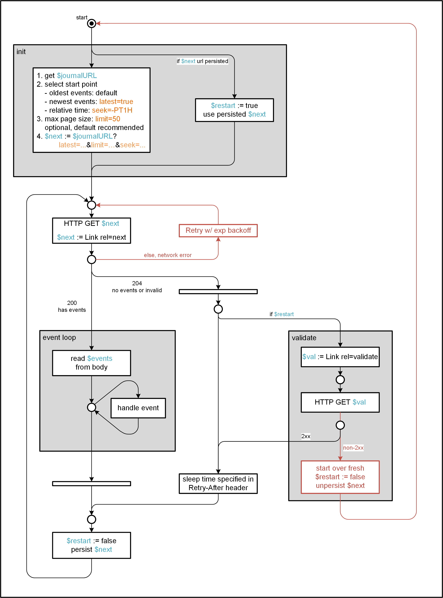

# Journal V2 Data flow and REST API

## References

* [Journaling With S3](https://wiki.corp.adobe.com/x/P_OfWQ)
* [Journaling 2.0 - Internals](https://wiki.corp.adobe.com/pages/worddav/preview.action?fileName=Journaling+2.0+-+Internals.pptx&pageId=1503650623)
* [Swagger](https://git.corp.adobe.com/pages/adobeio/s3-journey/#/)
* [nui/nui#105](https://git.corp.adobe.com/nui/nui/issues/105)

## Consumption Logic

## REST API

The REST API is documented in [Swagger](https://git.corp.adobe.com/pages/adobeio/s3-journey/#/). These are details we discovered from the slides linked under _References_ that have not been documented yet:

* The `seek` parameter takes durations in [ISO8601 format](https://en.wikipedia.org/wiki/ISO_8601) and is not exact, it returns the oldest closest position to the sought position.
* The `latest` parameter means you get events from 'now'. That usually means you get a _204 status_ with a link to the absolute latest position, or a _200 status_ with events that just became available.
* The _204 status_ is returned in 3 cases (when events newer than the specified position do no exist yet, the events did exist in the past but are no longer available (have been purged), the position actually never existed in the journal)
* The _validate_ link should mention that it can be used to distinguish the invalid/purge case vs valid but no new events

One observation that hasn't been documented is that if you fetch events from a journal with the `limit` parameter, that `limit` parameter will be sent back in the `next` link.
